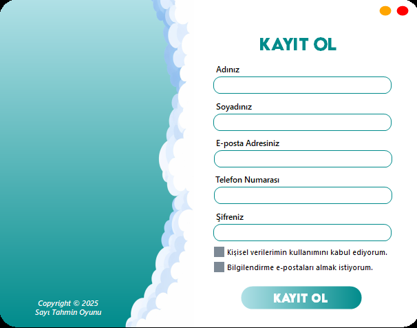
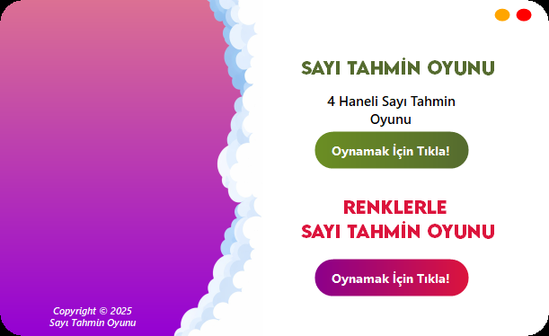
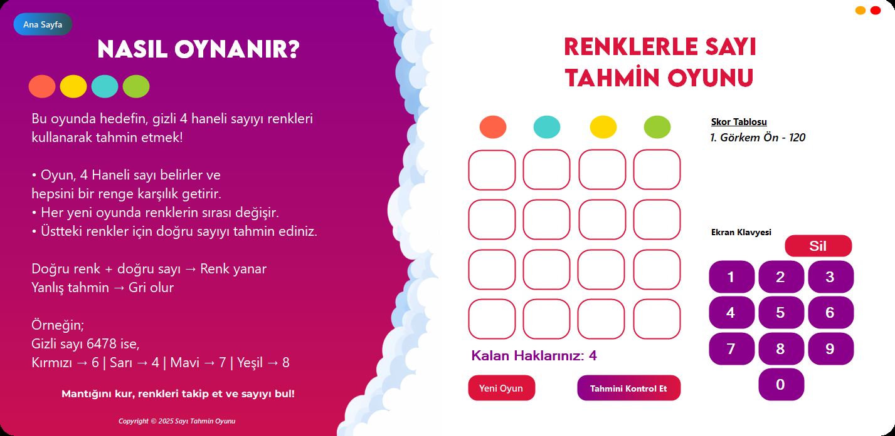

# 🎮 Giriş & Kayıt Sistemli Sayı Tahmin Oyunları

Bu proje, C# WinForms kullanılarak geliştirilmiş çoklu oyun içeren bir (Winforms) uygulamasıdır.
Uygulamada kullanıcı giriş ve kayıt sistemi ile ana sayfa yapısı bulunmaktadır.
Ana sayfa üzerinden iki farklı oyuna erişim sağlanmakta ve oyunlar ayrı formlar üzerinde çalışmaktadır.
Proje, dönem sonu ödevi kapsamında arayüz tasarımı, form geçişleri ve kullanıcı etkileşimi odaklı olarak hazırlanmıştır.

---

## 📌 Proje İçeriği
Uygulama tek bir proje içerisinde aşağıdaki bölümlerden oluşmaktadır:

- Giriş Yap Ekranı  
- Kayıt Ol Ekranı  
- Ana Sayfa  
- 4 Haneli Renkli Sayı Tahmin Oyunu
- 4 Haneli Sayı Tahmin Oyunu

---

## 🛠 Kullanılan Teknolojiler

- C#
- Windows Forms
- Guna UI2 
- Visual Studio
- Neon Database
  
---

## 🎨 Renkli Sayı Tahmin Oyunu
Oyunda kullanıcıdan gizlenen **4 haneli bir sayı**, her yeni oyunda rastgele olarak  
**kırmızı, mavi, yeşil ve sarı** renklere atanır.

Kullanıcının amacı:
- Renkleri kullanarak doğru sayıyı tahmin etmek
- Doğru tahminlerde ilgili renk aktif olur
- Yanlış tahminlerde renk griye döner
- Her yeni oyunda renk–sayı eşleşmeleri değişir
- Kullanıcının 4 tahmin hakkı vardır

## 🔢 4 Haneli Sayı Tahmin Oyunu

- Sistem rastgele 4 haneli bir sayı üretir
- Kullanıcı belirlenen hak sayısı içinde sayıyı tahmin eder
- Girilen tahminlere göre yönlendirme ve geri bildirim sağlanır
- Kullanıcının 15 tahmin hakkı vardır

---

## Bu projenin amacı;
- WinForms bileşenlerini etkin kullanmak
- Formlar arası geçişleri doğru şekilde yönetmek
- Kullanıcı giriş–kayıt sistemini uygulamak
- Neon Database (PostgreSQL) kullanarak kullanıcı verilerini bulut tabanlı olarak saklamak
- Oyun mantığını kod tarafında doğru kurmak
- Temiz ve anlaşılır kod yazımı sağlamaktır

## Kurulum
Assets klasörün içindeki 3 parttan oluşan rar dosyalarını indiriniz 
NOT: Dosya boyutu çok büyük olduğu için 3 ayrı .rar dosyası olarak oluşturmak zorunda kaldım. (Alternatif yöntemi yapamadım)
İndirdiğiniz part1 olan .rar dosyasının içindeki klasörünü çıkartınız.
- Klasörün içinde .sln dosyasını açarak kodlara ve tasarıma ulaşabilirsiniz
- Klasörün içinde .exe dosyaları -> Klasörü açtığınızda
  -> **GirişEkran\bin\Release\net8.0-windows** bulunmaktadır.

---

## 📷 Oyun İçi Ekran Görüntüleri
Aşağıda uygulamaya ait oyun içi ekranlardan alınmış örnek görüntüler yer almaktadır.

### 🔐 Giriş Ekranı
- Kullanıcılar, e-posta adresleri ile sisteme giriş yapmaktadır.
- Şifre giriş alanında `PasswordChar` özelliği kullanılarak girilen karakterler gizlenmiştir.
- Başarılı giriş işlemi sonrasında kullanıcı ana sayfa ekranına yönlendirilmektedir.
- Şifre alanında klavyeden **Enter** tuşuna basıldığında, giriş yapma işlemi otomatik olarak tetiklenmektedir.
  

   
  <em>Kullanıcının kullanıcı adı ve şifre ile giriş yaptığı ekrandır.</em>

### 📝 Kayıt Ekranı
- Kayıt ekranında şifre giriş alanında `PasswordChar` özelliği kullanılarak girilen karakterler gizlenmiştir.
- Kayıt sırasında yer alan onay checkbox’larının işaretlenmesi zorunlu değildir.
- Şifre textbox’unda **Enter** tuşuna basıldığında, **Kayıt Ol** butonu ile aynı işlevsellik çalışmaktadır.
- **Kayıt Ol** butonuna basıldığında kullanıcı kayıt işlemi gerçekleştirilir ve ardından giriş ekranına yönlendirilir.
- Giriş işlemi, kayıt sırasında girilen e-posta adresi ve şifre bilgileri ile yapılmaktadır.
- Kayıt sistemi Neon Database tarafından tutulmaktadır.

   
  <em>Yeni kullanıcıların sisteme kayıt olduğu ekrandır.</em>

### 🏠 Ana Sayfa
- Ana sayfa ekranında iki farklı oyun seçeneği bulunmaktadır.
- Kullanıcı, oynamak istediği oyun için **“Oyunu Oynamak İçin Tıkla”** butonuna bastığında ilgili oyun ekranına yönlendirilmektedir.

   
  <em>Kullanıcının oynayacağı oyunu seçtiği ana menüdür.</em>

### 🎨 Renkli Sayı Tahmin Oyunu
- Renkli Sayı Tahmin Oyunu’nda sistem tarafından rastgele üretilen 4 haneli bir sayı oluşturulur. 
- Oluşturulan sayının her bir basamağı, belirlenen renklerden biri ile eşleştirilir. Kullanıcı, bu renk eşleşmelerini referans alarak sayıyı tahmin eder. 
- Yapılan her tahmin, sistem tarafından karşılaştırılarak sonuçlar renk değişimleri üzerinden kullanıcıya geri bildirim olarak sunulur.

   
  <em>Renkler üzerinden 4 haneli gizli sayının tahmin edildiği oyundur.</em>

### 🔢 4 Haneli Sayı Tahmin Oyunu
- Daha önce geliştirmiş olduğum 4 haneli sayı tahmin oyunu projesi, bu projeye entegre ettim.
- İlgili projeye GitHub üzerindeki repolarım aracılığıyla ulaşabilirsiniz. ^^

    
  <em>Sistem tarafından rastgele üretilen 4 haneli sayının, kullanıcı tarafından belirlenen deneme hakları içerisinde tahmin edilmesi amaçlanır.</em>

## Notlar

- Tüm oyunlar tek bir proje içerisinde, ayrı formlar olarak geliştirilmiştir. 
- Kodlar okunabilirlik ve öğretim amacıyla sade tutulmuştur.

## Ek Bilgiler

- **Ders:** Görsel Programlama 2  
- **Proje Türü:** Dönem Sonu Projesi  

  

